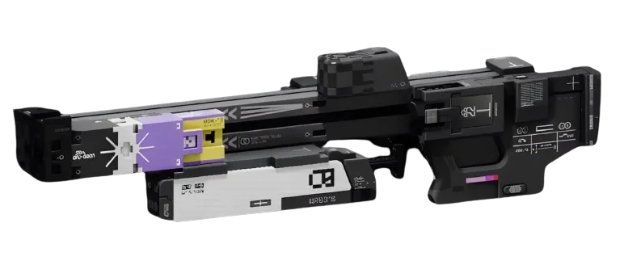
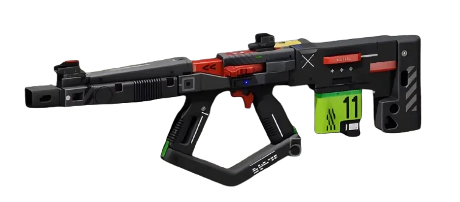
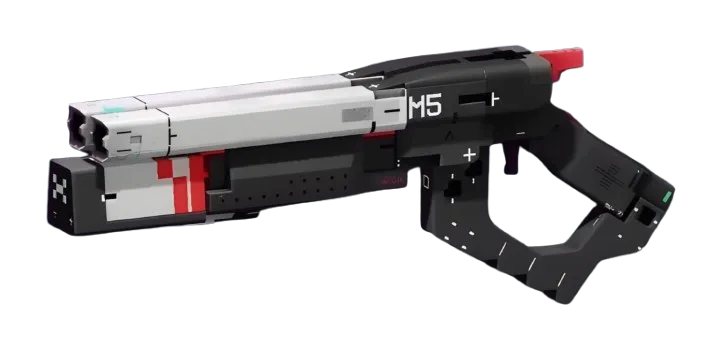
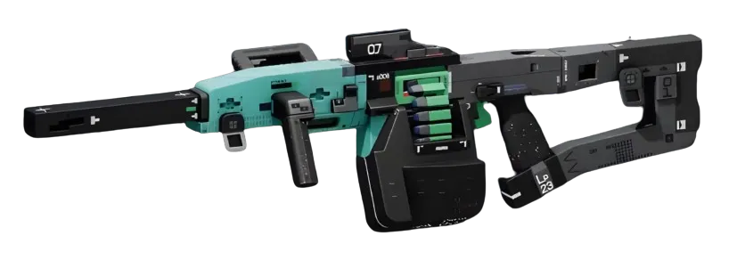
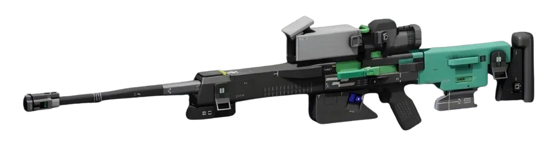
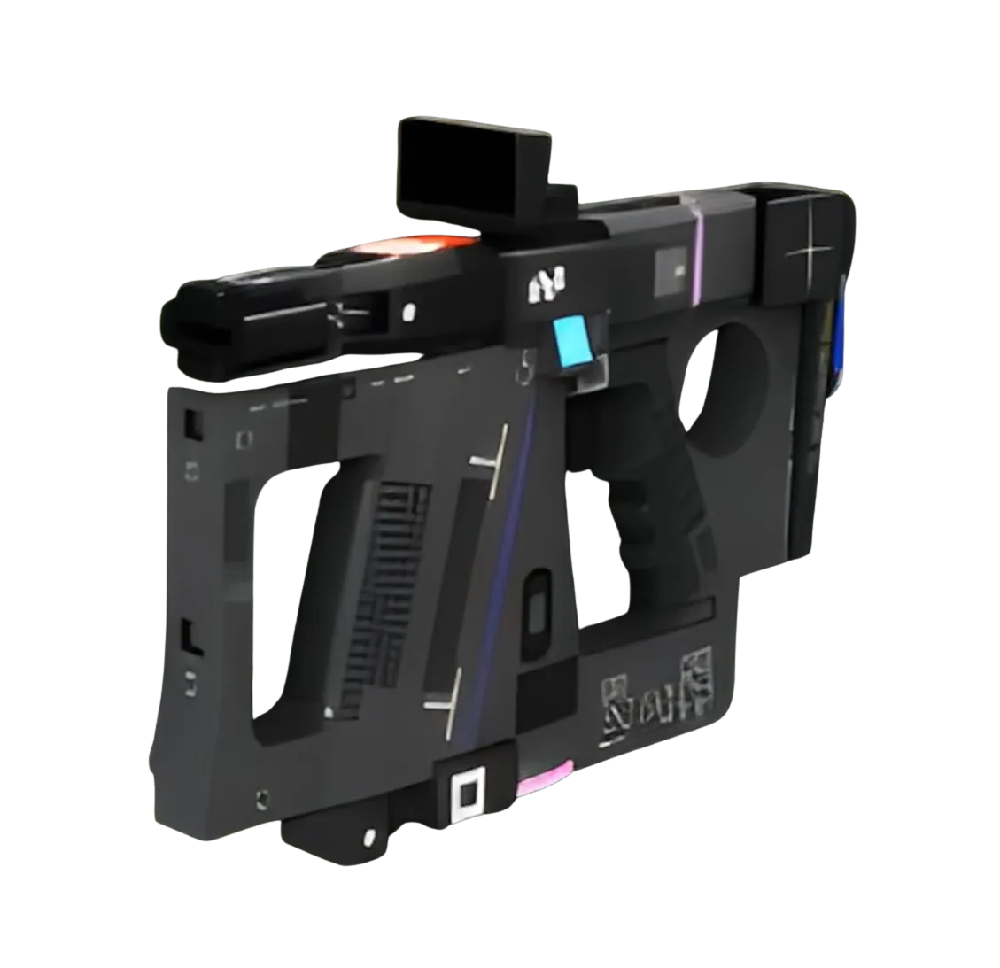

<p align="center">
  
</p>

<h1 align="center">Marathon Weapon Wiki</h1>

<p align="center">
  <strong>A tactical weapon database for Bungie's Marathon</strong><br/>
  Full stats, damage values, rate of fire, and combat data for every weapon in the game.
</p>

<p align="center">
  <a href="https://nextjs.org"></a>
  <a href="https://www.prisma.io"></a>
  <a href="https://tailwindcss.com"></a>
  <a href="https://trpc.io"></a>
</p>

---

## What is this?

Marathon Weapon Wiki is a community-built reference for every weapon in [Marathon](https://www.bungie.net/marathon) — Bungie's upcoming extraction shooter. It provides:

- **Complete weapon roster** — 27+ weapons across 8 categories (Assault Rifles, SMGs, LMGs, Shotguns, Sniper Rifles, Precision Rifles, Pistols, Railguns)
- **Detailed stat breakdowns** — Damage, rate of fire, accuracy, handling, recoil, ADS speed, reload speed, magazine size, and more
- **Filterable grid view** — Browse and filter weapons by type
- **Individual weapon pages** — Deep-dive into every stat with visual progress bars
- **Weapon mods** — View linked and universal mods for each weapon
- **SEO & structured data** — Full JSON-LD schemas, OG images, sitemap, and robots.txt

<br/>

<table>
  <tr>
    <td align="center"><br/><sub>M77 Assault Rifle</sub></td>
    <td align="center"><br/><sub>WSTR Combat Shotgun</sub></td>
    <td align="center"><br/><sub>Conquest LMG</sub></td>
    <td align="center"><br/><sub>Longshot</sub></td>
    <td align="center"><br/><sub>V22 Volt Thrower</sub></td>
  </tr>
</table>

---

## Breacher.net

This project is part of the broader [**BREACHER.NET**](https://breacher.net/) ecosystem — the community hub and live tracker for the Marathon ARG (Alternate Reality Game).

**BREACHER.NET** is built and maintained by the **Breachers of Tomorrow** community and serves as the central resource for everything Marathon ARG:

- **Live Statistics** — Real-time UESC kill counts, sector completion status, and stabilization metrics
- **Cryoarchive Tools** — Interactive dashboards tracking sector states, ship date countdowns, kill rate charts, and CCTV camera feeds
- **Interactive Maps** — Explorable maps of game locations including the Perimeter, Dire Marsh, and Outpost
- **Index Archives** — Catalogued cryoarchive entries with lock statuses and deployment tracking
- **Community Resources** — Links to the community wiki, Discord server, shared documentation, and the Winnower Garden historical data archive

> BREACHER.NET is not affiliated with Bungie. It is a fan-made community resource.

The Marathon Weapon Wiki complements BREACHER.NET by providing a dedicated, searchable database for weapon stats and combat data — giving Breachers the intel they need before dropping in.

---

## Tech Stack

| Layer | Technology |
|-------|-----------|
| Framework | [Next.js 16](https://nextjs.org) (App Router, React Server Components) |
| Database | PostgreSQL + [Prisma 6](https://prisma.io) ORM |
| API | [tRPC 11](https://trpc.io) with end-to-end type safety |
| Styling | [Tailwind CSS 4](https://tailwindcss.com) with custom dark theme |
| Language | TypeScript 5.8 (strict) |
| Runtime | Node.js with Turbopack dev server |

---

## Getting Started

```bash
# Clone the repo
git clone https://github.com/your-username/marathon-weapon-wiki.git
cd marathon-weapon-wiki

# Install dependencies
bun install

# Set up environment
cp .env.example .env
# Edit .env with your PostgreSQL connection string

# Push schema & seed the database
bun run db:push
bun run db:seed

# Start the dev server
bun run dev
```

Open [http://localhost:3000](http://localhost:3000) to browse the wiki.

### Environment Variables

| Variable | Required | Description |
|----------|----------|-------------|
| `DATABASE_URL` | Yes | PostgreSQL connection string |
| `NEXT_PUBLIC_SITE_URL` | No | Production URL for canonical links, OG images, and sitemap (defaults to `http://localhost:3000`) |

### Database Commands

```bash
bun run db:generate   # Run Prisma migrations (dev)
bun run db:migrate    # Deploy migrations (production)
bun run db:push       # Push schema changes directly
bun run db:seed       # Seed weapon data
bun run db:studio     # Open Prisma Studio GUI
```

---

## Project Structure

```
src/
├── app/
│   ├── layout.tsx              # Root layout with metadata & fonts
│   ├── page.tsx                # Home — weapon grid with filters
│   ├── icon.tsx                # Dynamic favicon
│   ├── apple-icon.tsx          # Apple touch icon
│   ├── opengraph-image.tsx     # Home page OG image
│   ├── robots.ts               # Crawler rules
│   ├── sitemap.ts              # Dynamic sitemap
│   ├── manifest.ts             # PWA manifest
│   ├── _components/            # Shared UI components
│   └── weapons/[slug]/
│       ├── page.tsx            # Weapon detail page
│       └── opengraph-image.tsx # Per-weapon OG image
├── lib/
│   └── structured-data.ts     # JSON-LD schema helpers
├── server/
│   ├── db.ts                  # Prisma client
│   └── api/                   # tRPC routers
├── trpc/                      # tRPC client setup
└── styles/
    └── globals.css            # Tailwind theme & custom styles
```

---

## License

This is a fan-made community project. Marathon is a trademark of Bungie, Inc. Not affiliated with or endorsed by Bungie.
